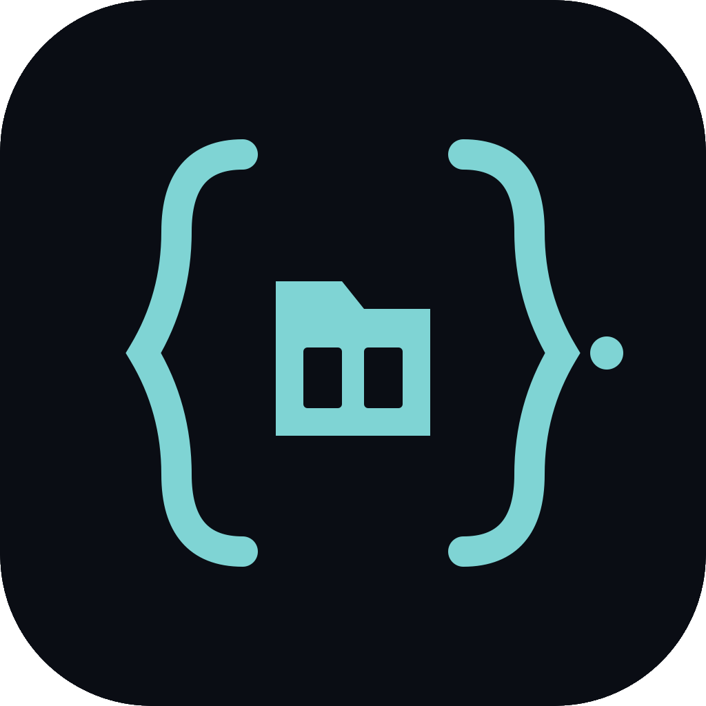
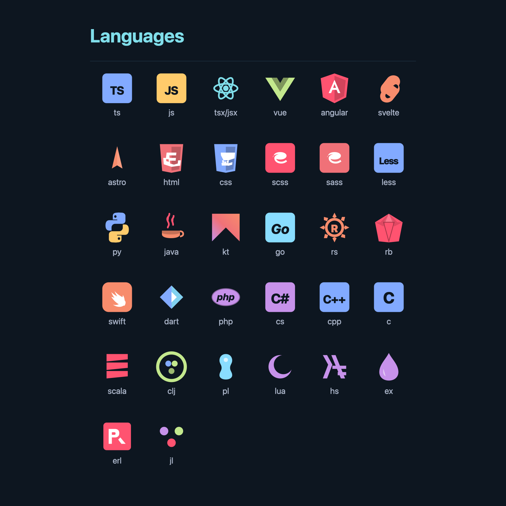
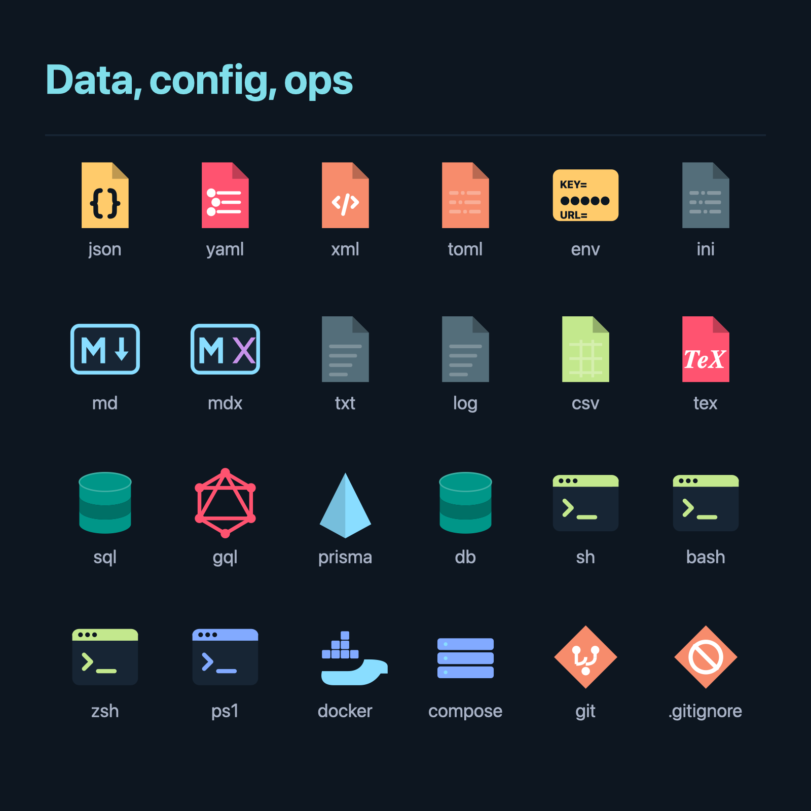
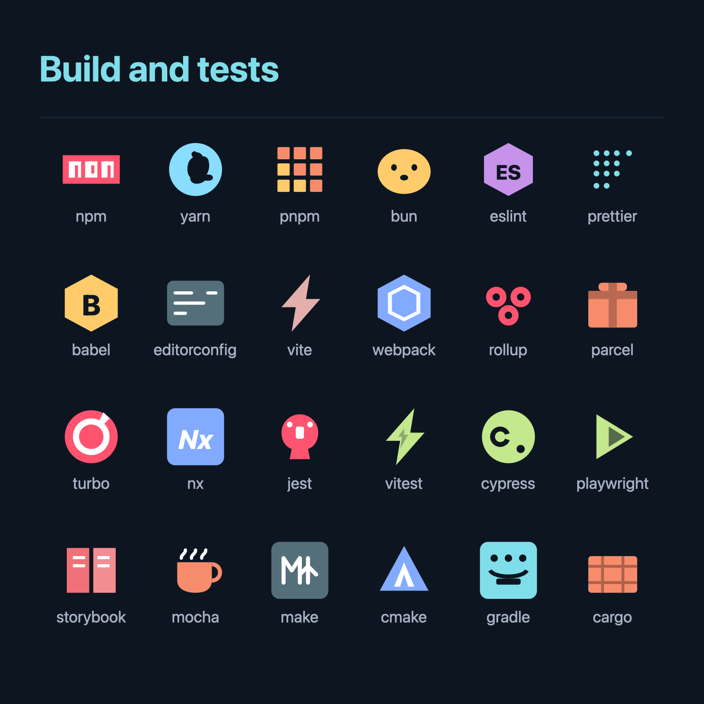
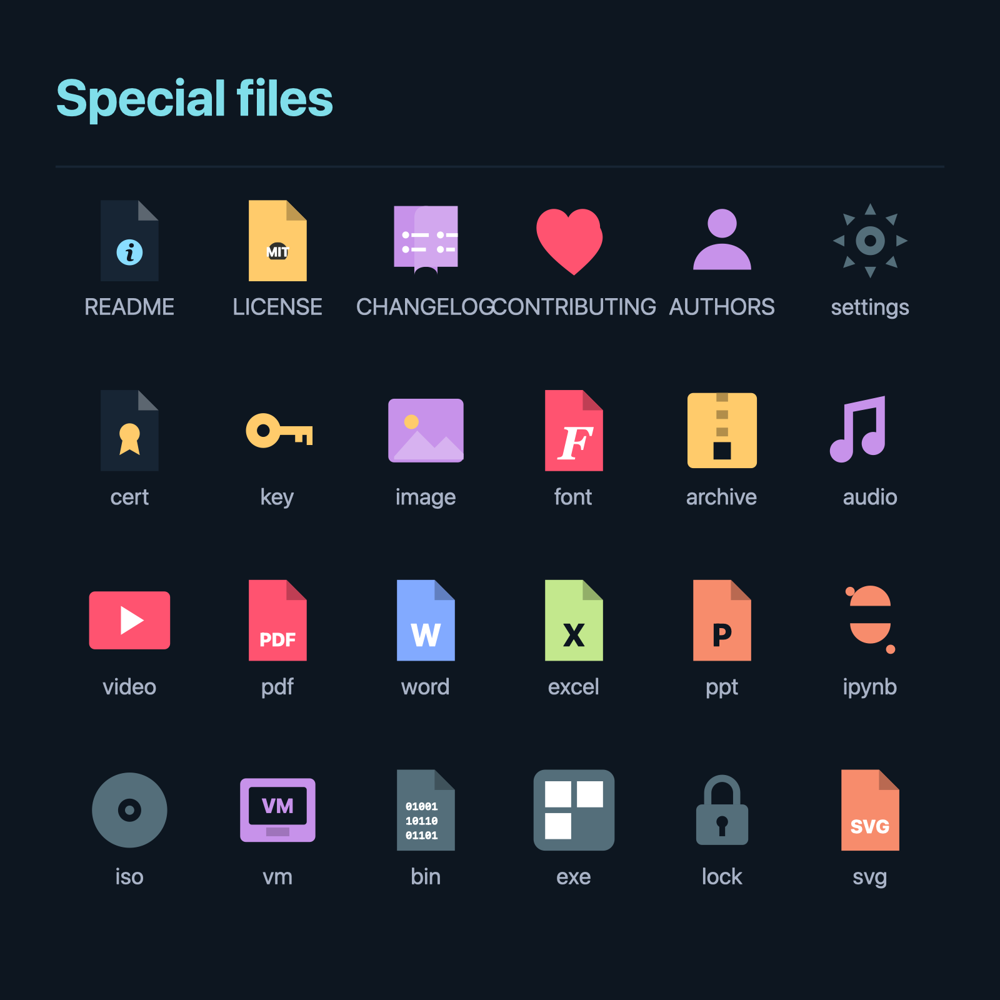
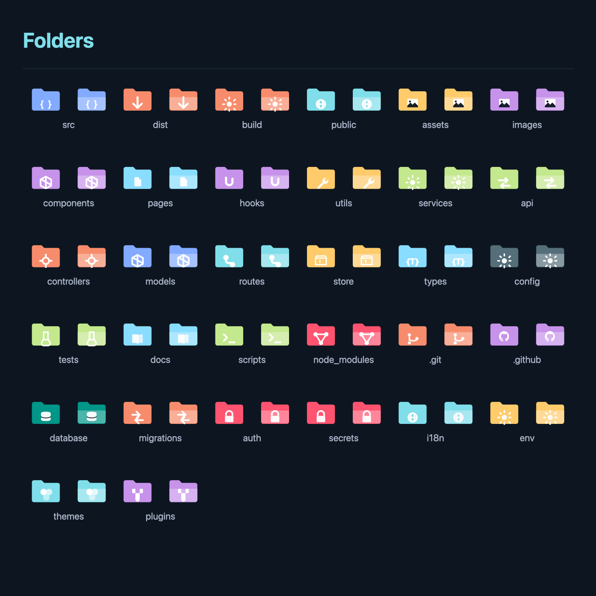

<div align="center">



# Lusitania Icon Theme

A deep-sea file & folder icon theme for VS Code & Cursor.
Inspired by IntelliJ *Atom Material Icons*. Recoloured with the Lusitania palette.

[](https://github.com/sahernandezz/lusitania-icon-theme)
[](LICENSE.txt)
[](https://code.visualstudio.com/)

</div>

---

Pairs with the [Lusitania colour theme](https://github.com/sahernandezz/lusitania-theme) so the editor and the explorer share one visual identity. Every icon is a unique silhouette — never a generic letter on a coloured square — and the long tail of file types gets a clean folded-document glyph rather than a placeholder.

## Languages

<p align="center"></p>

## Data, config, ops

<p align="center"></p>

## Build and tests

<p align="center"></p>

## Special files

<p align="center"></p>

## Folders

Closed and open variants side-by-side.

<p align="center"></p>

## Coverage

| Category | Count |
|---|---|
| File extensions | **176** |
| Special file names | **129** |
| Folder names (closed + open) | **80** distinct · **179** aliases |
| Language IDs | **56** |
| Total SVG icons | **302** |

## Install

**Marketplace** — search `Lusitania Icon Theme` → *Install* → `Cmd/Ctrl+Shift+P` → *File Icon Theme* → **Lusitania Icons**.

**`.vsix`**
```sh
code --install-extension lusitania-icon-theme-1.0.0.vsix
```

**From source**
```sh
git clone https://github.com/sahernandezz/lusitania-icon-theme.git
cd lusitania-icon-theme
code .   # press F5 to launch an Extension Development Host
```

## Palette

The same palette as [Lusitania Theme](https://github.com/sahernandezz/lusitania-theme), so editor and tree never clash.

| Token | Hex | Used for |
|---|---|---|
| Teal | `#009688` | default folders, primary accent |
| Cyan | `#80deea` | React, public, client-side |
| Cyan alt | `#89ddff` | constants, Markdown, types |
| Blue | `#82aaff` | TypeScript, Python, CSS, models |
| Purple | `#c792ea` | components, hooks, C#, PHP |
| Green | `#c3e88d` | shells, tests, strings |
| Yellow | `#ffcb6b` | JavaScript, JSON, classes, assets |
| Orange | `#f78c6c` | Java, Rust, build outputs |
| Red | `#ff5370` | Ruby, SCSS, node_modules, errors |
| Coral | `#f07178` | HTML |
| Gray | `#546e7a` | comments, ignored, temp |

## Security

This extension is **purely declarative** and ships only static assets:

- `package.json` has no `main`, `activationEvents`, `scripts`, `extensionDependencies` or `extensionPack` — VS Code never executes code from this package.
- The only contribution is `iconThemes` (a JSON mapping + 302 SVGs).
- SVGs contain no `<script>`, `<foreignObject>`, `<iframe>`, `xlink:href`, `href="http…"`, `data:` URIs, event handlers or `CDATA` sections.
- No network calls, no telemetry, no file-system access.

Verify with one grep:
```sh
grep -rEi '<script|foreignObject|xlink:href|javascript:|on(load|click|error)=' icons/
```

## Build

Icons and the mapping are generated by [`build.py`](build.py); preview images by [`build_previews.py`](build_previews.py). Both use Python 3 standard library and `qlmanage` (macOS) for SVG → PNG — no external dependencies.

```sh
python3 build.py             # rewrites icons/*.svg and lusitania-icon-theme.json
python3 build_previews.py    # rewrites previews/*.svg and previews/*.png
```

## License

[MIT](LICENSE.txt).
